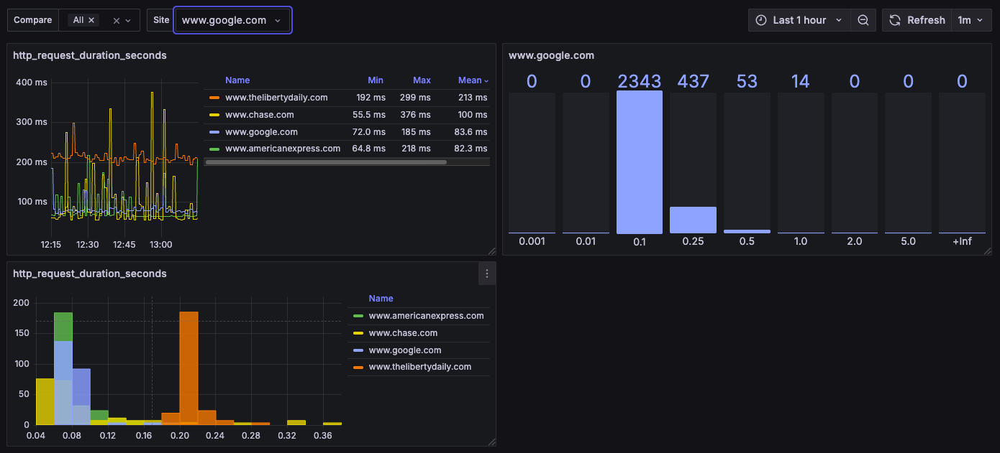

## site_exporter

## install

Read collector.go.  Begining at line 37 there is a description of the format and fields for the site file.  Then take a look at the unit service file to see installation and operation. Only no auth and basic auth are currently supported.

## to do

- Add summary metrics
- Certificate based auth
- OAuth
- Token based auth